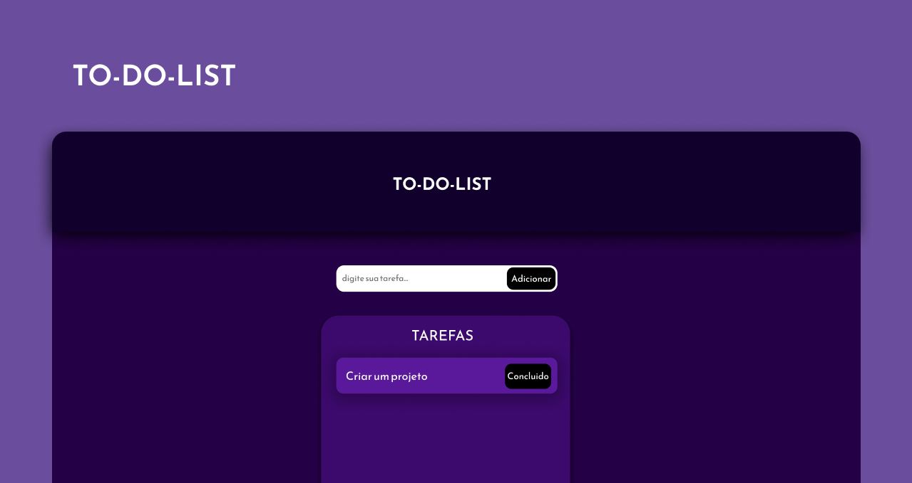

# TO-DO-LIST

## Tópicos

[Sobre o TO-DO-LIST](#sobre-o-TO-DO-LIST)

[Tecnologias](#tecnologias)

 

## Sobre o TO-DO-LIST

O TO-DO-LIST foi desenvolvido durante os estudos sobre HTML, CSS E JAVASCRIPT com o objeitvo de colocar em pratica algumas coisas que venho estudando há algum tempo. O projeto foi de extrema importância para meu aperfeiçoamento tendo em vista que foi praticado Manipulaçao de dados, manipulação de elementos da Dom, estilização, etc. O desafio consistia em criar do zero uma aplicação de um To-do-list ultilizando html, css e js. 

 

  

## Tecnologias

Tecnologias e ferramentas utilizadas no desenvolvimento do projeto:

- JAVASCRIPT
- HTML
- CSS

By: [Ruan Victor](https://github.com/ruanovski)

